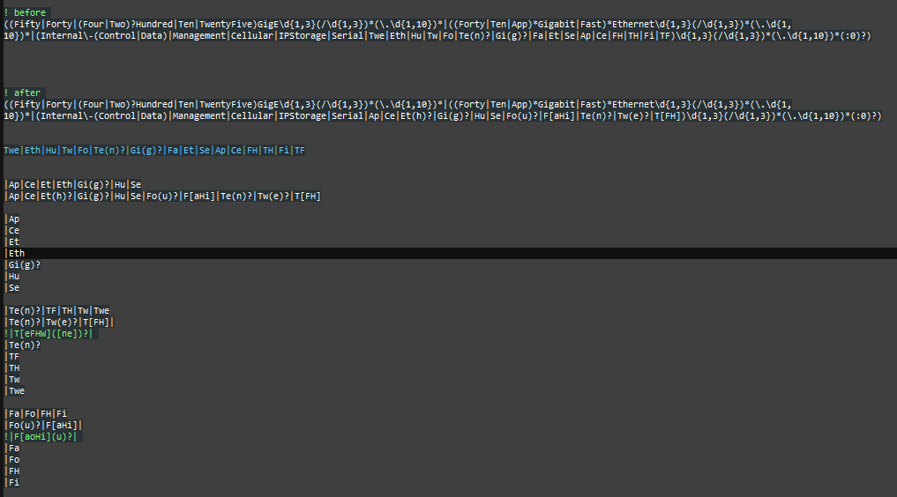

# securecrt-keyword-highlighting

## New:

Added **feralpacket_iosxr_2024.ini**.  These are changes for IOS XR.  Not sure if there will end up being some conflicting regex I use for IOS and IOS XE.  So, I'm creating a separate .ini just in case.  Work in progress.  Will probably not be complete until some time after the CCIE SP bootcamp I'm attending this June.

Starting with SecureCRT version 9.3, the length of the regular expression for each line was increased.  

**feralpacket2023.ini** ( and **feralpacket2024.ini** ) will start using longer regular expressions.  This will allow me to do some consolidation and reduce the number of lines.  Maybe, someday. 

Note, the regular expressions I had been using where up to 256 characters long.  **shrug**

From SecureCRT_HISTORY.TXT:

  > - Increased the character limit for keywords from 246 to 2048,
  >   which allows more complex regular expressions to be specified
  >  for keyword highlighting.

## My original blog post from 2016.

**SecureCRT Text Highlighting**

https://feralpacket.org/?p=299

## Updated blog post from 2019.

**Regular Expressions For SecureCRT Keyword Highlighting – Update**

https://feralpacket.org/?p=817

This contains an updated .ini file that I shared with the Routergods and Art of Network Engineering communities.

http://dentonj.freeshell.org/

## Making Changes

Every so often, someone emails me a version of an .ini file that the edited directly.  Please, don't do that.  Not only do you have to consider whether your regex changes actually worked.  But you also have to make sure you didn't mess up the format of the .ini file.  Make any changes inside of the app.

There are multiple was of getting there.  But there is only one .ini file or list name that you are editing.  My preferred way is through Options -> Session Options.

Then go to Terminal -> Keyword Highlighting.  Click on the line you want to edit to get the Edit Keyword box.  You can make changes here, but I don't recommend it.  Copy the line to a text file and make the changes there.  

I have a **! before** section with the regex before I start making changes.  There have been times my changes ended up not working and I just made a mess.  If that happens, you can copy the before state of the regex back.

I have an **! after** section.  This is were I make my changes.  Sometimes, I'll have several versions or copies of the same regex I'm changing.  For some of the more complicated regex, I break them out below this section.  I separate each regex with the associated "|".  This makes it easier to read.

Here are my notes from when I realized that FourHunderdGigE interfaces used "Fou" for the short version of the interface name.  I also used this addition as a good time to clean up the regex.

When you are done with your changes, copy your new regex back into the Edit Keywork box and save.  Then check to see if the chanes you wanted took affect.  Sometimes you have to scroll the text off of the screen and back before the changes highlight the new text.

Because your changes are made to the .ini file, any sessions that uses that .ini file or list name will have the updated changes.  You don't need to change the Default Session.

The changes I made to feralpacket2024.ini for the new interface short name.

Testing hint:  You don't need to have the proper show command to test your changes.  If you know what the text that you want highlighted should look like, just type it in at the cli.

